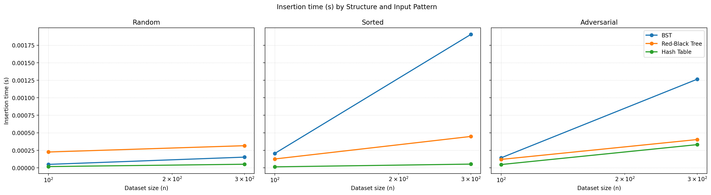
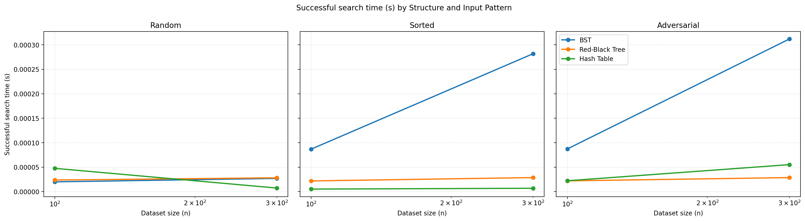
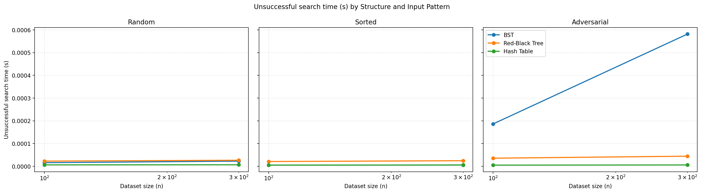

# Empirical Analysis of Search Structures

Author: Aye Khin Khin Hpone (Yolanda Lim) - st125970

## Table of Contents

- [Empirical Analysis of Search Structures](#empirical-analysis-of-search-structures)
  - [Table of Contents](#table-of-contents)
  - [1. Project Overview](#1-project-overview)
  - [2. Implementation Approach](#2-implementation-approach)
    - [2.1 Binary Search Tree](#21-binary-search-tree)
    - [2.2 Red-Black Tree](#22-red-black-tree)
    - [2.3 Hash Table](#23-hash-table)
  - [3. Experimental Setup](#3-experimental-setup)
  - [4. Dataset Design](#4-dataset-design)
    - [4.1 Random Input](#41-random-input)
    - [4.2 Sorted Input](#42-sorted-input)
    - [4.3 Adversarial Input](#43-adversarial-input)
  - [5. Performance Results](#5-performance-results)
    - [Insertion Time](#insertion-time)
    - [Successful Search Time](#successful-search-time)
    - [Unsuccessful Search Time](#unsuccessful-search-time)
  - [6. Discussion and Interpretation](#6-discussion-and-interpretation)
  - [7. How to Run](#7-how-to-run)
  - [8. Requirements Coverage](#8-requirements-coverage)
  - [9. Submission Checklist](#9-submission-checklist)

## 1. Project Overview

This project compares three search structures for ADA2026 Assignment 3 Question 8:

- Binary Search Tree
- Red-Black Tree
- Hash Table (separate chaining)

The program measures insertion and search performance under multiple input patterns and exports results as CSV tables and plots.

Main files:

- `search_structures_yolanda.py`
- `results/` (full-mode artifacts)
- `results_quick/` (quick-mode artifacts)

## 2. Implementation Approach

### 2.1 Binary Search Tree

- Iterative `insert` and `search`
- No self-balancing
- Height measured by BFS after insertion
- Expected worst-case height approaches $n$ for ordered insertions

### 2.2 Red-Black Tree

- Uses a `NIL` sentinel node
- Rebalancing through recoloring and rotations after insertion
- Iterative `search`
- Height expected to stay $O(\log n)$

### 2.3 Hash Table

- Separate chaining with list buckets
- Hash function: `key % table_size`
- Reports load factor, average non-empty chain length, and collision count
- Adversarial hash input is constructed to force bucket concentration

## 3. Experimental Setup

- Timer: `time.perf_counter()`
- Measures: insertion, successful search, unsuccessful search
- Output: console summary + CSV + PNG plots

Run modes:

- Full mode:
  - Sizes: `1000`, `10000`, `100000`
  - Trials: `3`
  - Search sample size: up to `1000` hits and `1000` misses
- Quick mode:
  - Sizes: `100`, `1000`
  - Trials: `2`
  - Search sample size: up to `100` hits and `100` misses

## 4. Dataset Design

### 4.1 Random Input

- Unique keys sampled from a wider numeric range
- Represents average-case behavior

### 4.2 Sorted Input

- Ascending insertion order
- Produces worst-case behavior for plain BST
- Red-Black Tree should remain balanced

### 4.3 Adversarial Input

- Trees use reverse-sorted insertion
- Hash table uses multiples of table size so keys collide strongly
- Highlights worst-case or near-worst-case degradation behavior

## 5. Performance Results

The script generates these files:

- `results/experiment_summary.csv`
- `results/experiment_trials.csv`
- `results/insert_times.png`
- `results/search_hit_times.png`
- `results/search_miss_times.png`

### Insertion Time



### Successful Search Time



### Unsuccessful Search Time



CSV evidence for this report is provided in:

- `results/experiment_summary.csv`
- `results/experiment_trials.csv`

These files are the raw performance results, while the plots above are the visual summary.

Important for final submission:

- Before packaging your submission, run full mode once so `results/` contains assignment-scale evidence:

```powershell
python search_structures_yolanda.py --mode full
```

## 6. Discussion and Interpretation

Expected interpretation:

- BST is fast on random input but degrades heavily for ordered/adversarial insertion.
- Red-Black Tree keeps stable logarithmic behavior across patterns.
- Hash Table is near constant-time on normal patterns but degrades when collisions are concentrated.

If your full-mode results follow this trend, empirical behavior aligns with theoretical complexity.

## 7. How to Run

1. Install dependencies:

```powershell
pip install -r requirements.txt
```

1. Quick validation run:

```powershell
python search_structures_yolanda.py --mode quick
```

1. Final assignment run:

```powershell
python search_structures_yolanda.py --mode full
```

Notes:

- Quick mode writes to `results_quick/`
- Full mode writes to `results/`
- Full mode can take longer because BST worst-case insertion is intentional

## 8. Requirements Coverage

The assignment asks for the following submission items. This report addresses each item directly:

- Implementation approach → [Section 2](#2-implementation-approach)
- Experimental setup → [Section 3](#3-experimental-setup)
- Dataset design → [Section 4](#4-dataset-design)
- Performance results → [Section 5](#5-performance-results) + CSV artifacts in `results/`
- Discussion and interpretation → [Section 6](#6-discussion-and-interpretation)

## 9. Submission Checklist

- `search_structures_yolanda.py`
- `README.md`
- `requirements.txt`
- `results/experiment_summary.csv`
- `results/experiment_trials.csv`
- `results/insert_times.png`
- `results/search_hit_times.png`
- `results/search_miss_times.png`
